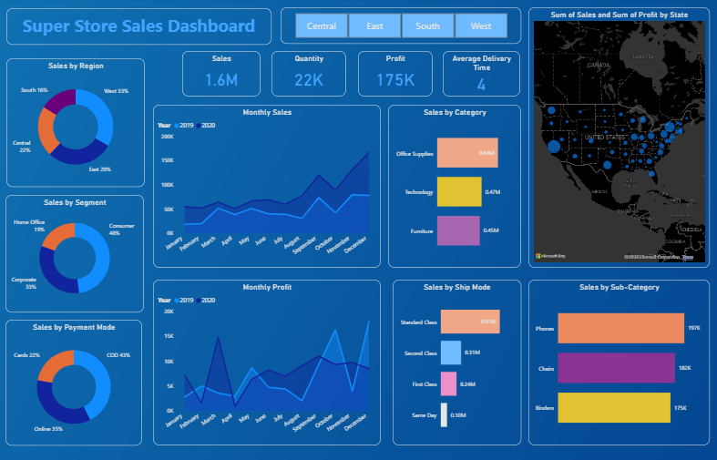

# 🛒 Super Store Sales Dashboard (Power BI)

## 📊 Overview

This Power BI dashboard provides a comprehensive analysis of Supermarket Sales data from the United States. It presents key metrics and visual insights into sales, profits, quantity sold, and average delivery time across different regions, customer segments, categories, and time periods.

---

## 🚀 Key Features

- ✅ Interactive Filters (Region-based: Central, East, South, West)
- 📌 KPI Cards for:
  - Total Sales: **1.6M**
  - Quantity Sold: **22K**
  - Total Profit: **175K**
  - Average Delivery Time: **4 days**
- 📅 Monthly Trends:
  - Sales & Profit comparison (2019 vs 2020)
- 🌍 Map Visual:
  - Sum of Sales and Profit by U.S. State
- 📦 Segmentation Visuals:
  - Sales by Region, Segment, Category, Sub-Category
  - Payment Modes and Ship Modes
- 🔮 **Forecasting Page**:
  - 15-day sales forecast using built-in analytics tools

---

## 🛠 Tools & Technologies

- **Power BI Desktop**
- **Power Query**: Data Cleaning & Transformation
- **DAX (Data Analysis Expressions)**: KPI calculations and time intelligence
- **Power BI Forecasting**: For time-series sales prediction

---

## 🔍 Insights Gained

- 📈 **Sales Growth**: Noticeable increase in 2020 compared to 2019
- 🗺 **Top Performing States**: Sales density higher in coastal and major urban states
- 🧾 **Popular Categories**: Office Supplies lead in sales, followed by Furniture and Technology
- 📦 **Consumer Segment**: Drives nearly half the total sales
- 💳 **Payment Modes**: COD (43%) is the most used mode
- 🚚 **Ship Mode Trends**: Standard and Second Class dominate deliveries
- 🔮 **Forecast Trend**: Upcoming 15-day trend helps anticipate sales fluctuations and plan inventory

---

